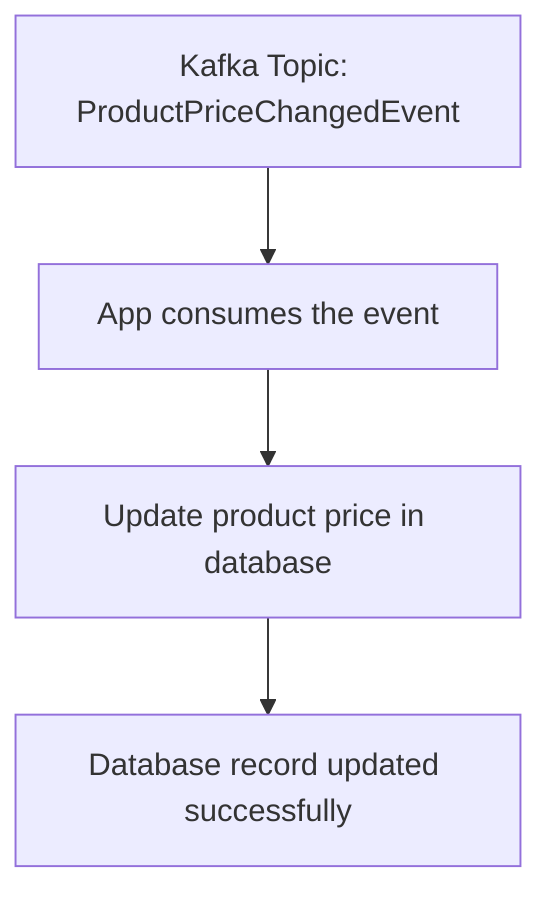

## Spring Kafka

1. Start the application by
   running [TestSpringKafkaApplication](src/test/java/com/att/training/springboot/examples/TestSpringKafkaApplication.java)
2. Run the [produce](http/produce.http) http request

### Tests

* Test the application by running
  the [KafkaComponentTest](src/test/java/com/att/training/springboot/examples/KafkaComponentTest.java) class

