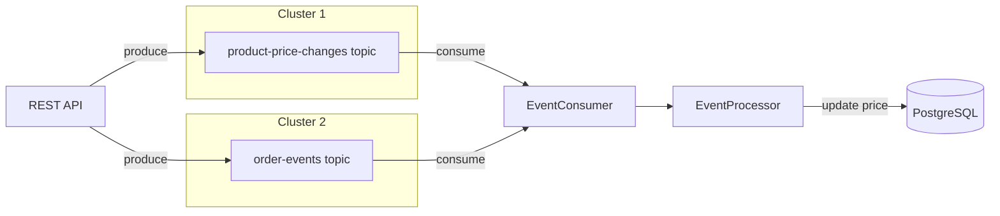

# Spring Kafka + PostgreSQL

A Spring Boot example demonstrating **Apache Kafka** integration with **PostgreSQL** — including multi-cluster Kafka configuration, event-driven database updates, custom health indicators, and integration testing with Testcontainers.

## Overview

This project showcases a realistic event-driven architecture where:

- A **product price change** event is consumed from Kafka and used to update a product's price in PostgreSQL
- An **order created** event is produced and consumed on a **separate Kafka cluster**, demonstrating multi-cluster support
- A custom **Kafka health indicator** is wired into Spring Boot Actuator readiness probes
- Integration tests use **Testcontainers** to spin up real Kafka and PostgreSQL instances


```mermaid
graph LR
    subgraph Cluster 1
        T1[product-price-changes topic]
    end
    subgraph Cluster 2
        T2[order-events topic]
    end

    API[REST API] -- produce --> T1
    API -- produce --> T2

    T1 -- consume --> Consumer[EventConsumer]
    T2 -- consume --> Consumer

    Consumer --> Processor[EventProcessor]
    Processor -- update price --> DB[(PostgreSQL)]
```

## Key Concepts

### Multi-Cluster Kafka Configuration

The app connects to **two independent Kafka clusters**. The default cluster uses standard Spring Boot auto-configuration. A second cluster is configured via custom properties (`app.kafka.cluster2`) and uses:

- A custom `@Cluster2` qualifier annotation to distinguish beans
- Dedicated `KafkaTemplate` and `ConsumerFactory` beans with overridden bootstrap servers
- A separate `ConcurrentKafkaListenerContainerFactory` for the second cluster's consumers
- Lombok's `copyableAnnotations` in [lombok.config](lombok.config) to propagate the `@Cluster2` qualifier through generated constructors

### Bean Validation on Kafka Messages

Kafka listeners validate incoming messages using Jakarta Bean Validation (`@Valid`). This is enabled by registering a `Validator` with the `KafkaListenerEndpointRegistrar` in [KafkaConfig](src/main/java/com/att/training/springboot/examples/KafkaConfig.java).

### Custom Health Indicator

[KafkaHealthIndicator](src/main/java/com/att/training/springboot/examples/KafkaHealthIndicator.java) uses the Kafka `AdminClient` to list topics and reports the broker as **UP** or **DOWN** accordingly. It's included in the actuator readiness group alongside the database health check.

### Event-Driven Database Updates

When a `ProductPriceChangedEvent` is consumed, the [EventProcessor](src/main/java/com/att/training/springboot/examples/EventProcessor.java) delegates to [ProductDao](src/main/java/com/att/training/springboot/examples/ProductDao.java) (backed by Spring's `JdbcClient`) to update the product's price in PostgreSQL.

### Testcontainers Integration

Tests use [Spring Boot's Testcontainers support](https://docs.spring.io/spring-boot/reference/testing/testcontainers.html) with `@ServiceConnection` for auto-configured Kafka and PostgreSQL containers. Two separate Kafka containers simulate the multi-cluster setup. Custom composed annotations (`@WithKafka`, `@WithPostgres`) keep test classes clean.

## Getting Started

### Prerequisites

- Java 25+
- Docker (required for Testcontainers)

### Run Locally with Testcontainers

The easiest way to run the app is via `TestSpringKafkaApplication`, which automatically starts Kafka and PostgreSQL containers:

```bash
./mvnw spring-boot:test-run -pl spring-kafka-postgres
```

### Produce Events

Once the app is running, use the HTTP requests in [http/produce.http](http/produce.http):

**Update product price** (default cluster):
```http
PUT http://localhost:8080/kafka/produce/price-change
Content-Type: application/json

{
  "code": "P9999",
  "price": "9.99"
}
```

**Create order** (cluster 2):
```http
POST http://localhost:8080/kafka/produce/order
Content-Type: application/json

{
  "orderId": "O1001",
  "customerId": "C42",
  "quantity": 3,
  "amount": "149.99"
}
```

**Check readiness:**
```http
GET http://localhost:8080/kafka/readyz
```

### Run Tests

```bash
./mvnw test -pl spring-kafka-postgres
```

## Tech Stack

| Component | Technology |
|---|---|
| Framework | Spring Boot 3.5 |
| Messaging | Apache Kafka (Spring Kafka) |
| Database | PostgreSQL (Spring JDBC / `JdbcClient`) |
| Health | Spring Boot Actuator |
| Validation | Jakarta Bean Validation |
| Testing | JUnit 5, Testcontainers, Awaitility, Mockito |
| Build | Maven |
